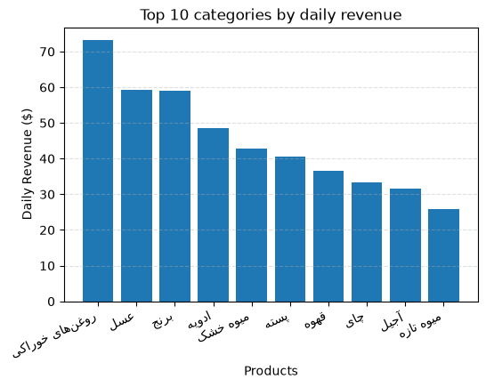

# BaSalam Sales Analysis

(EDA)Exploratory data analysis of product data from BaSalam, an Iranian online marketplace, answering business questions from different teams (CEO, Sales PM).

## Project Overview

I worked as an analyst answering real business questions using product data. Each notebook starts with a question and ends with an answer in plain language.

## Data

- **Source:** BaSalam products dataset [https://www.kaggle.com/datasets/radeai/basalam-comments-and-products]
- **Size:** 2.4 million rows (a sample of the first 5,000 / 100,000 rows)
- **Key columns:** `price`, `sales_count_week`, `categoryTitle`, `preparationDays`
- **Note:** The CSV files are not included in this repository because of their size.

## Business Questions & Notebooks

| # | Question | Asked by | Notebook |
|---|----------|----------|----------|
| 1 | How much is our daily revenue? | CEO | [01_daily_revenue](notebooks/daily_sales_revenue_01.ipynb) |
| 2 | Which categories generate the most daily revenue? | CEO | [02_revenue_by_category](notebooks/daily_sales_revenue_by_category_01.ipynb) |
| 3 | Is there a relationship between preparation time and sales? | Sales PM | [03_prep_time_vs_sales](notebooks/relation_btw_time&sale_01.ipynb) |

## Key Findings

- **Daily revenue:** Estimated at $872 for the sampled products.
- **Category concentration:** The top 3 categories generate 22% of revenue.
- **Preparation time:** There is only a very weak relationship between preparation time and weekly sales. Most products sell less than one unit per week regardless of preparation time.



## Assumptions & Limitations

- Currency conversion uses 1 USD = 150,000 Toman, a fixed rate (the real rate changes).
- Revenue is *estimated* as `price × weekly sales ÷ 7`.
- The data is a sample sorted by score, so it is not a random sample of all products.
- Correlation does not imply causation.

## Tools

Python, Pandas, Matplotlib, Seaborn, Jupyter

## How to Run

```bash
git clone https://github.com/YOUR_USERNAME/basalam-sales-analysis.git
cd basalam-sales-analysis
pip install -r requirements.txt
```
Place the CSV files in a `data/` folder, then open the notebooks in Jupyter.
